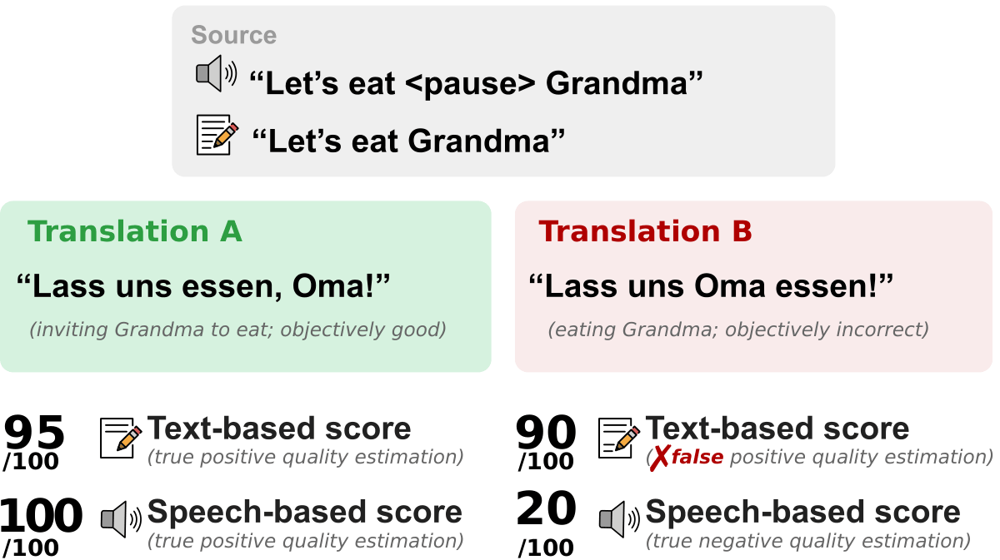

# Why We Need Speech to Evaluate Speech Translation

[](https://huggingface.co/collections/maikezu/speechcomet)

<p align="center"></p>

Speech translation models are increasingly capable of preserving speech-specific information (e.g. speaker gender, prosody, and emphasis), yet evaluation metrics remain blind to such phenomena.
We meta-evaluate both text- and speech-based quality estimation metrics on two contrastive datasets targeting gender agreement and prosody, and find that both fall short, even when given direct access to the speech signal.
We then train SpeechCOMET, a family of quality estimation models with speech encoders, and evaluate a state-of-the-art SpeechLLM as a judge.
Both match or exceed text-based COMET on standard quality estimation, but neither consistently assesses speech-specific phenomena.
We identify three causes:
(1) speech-specific features are not reliably preserved in current encoders,
(2) models tend to ignore the source signal,
and (3) quality estimation training data contains too few relevant examples.
We release all models and code, and argue that progress requires dedicated speech-specific training data and models that genuinely condition on speech.

This repository contains:
- **SpeechCOMET** model code, training configs, and evaluation scripts for [inference](#speechcomet-inference) and [training](#speechcomet-training) ([`configs/`](configs/), [`speechcomet/`](speechcomet/), [`speechcomet-eval/`](speechcomet-eval/))
- **[Baseline evaluation](#baselines)** scripts for text- and speech-based QE metrics ([`baselines-QE/`](baselines-QE/)) and SpeechLLM as a judge ([`baselines-speechllm/`](baselines-speechllm/))
- **[Data](#data)** preparation scripts for training and evaluation data ([`data-preparation/`](data-preparation/))

## Installation

```bash
git clone git@github.com:MaikeZuefle/speechCOMET.git
cd speechCOMET
pip install -e .
```

Requires Python 3.12+ and CUDA.

## SpeechCOMET Inference

SpeechCOMET models take a hypothesis translation and a source (text, speech, or both) and return a quality score. Pretrained models can be loaded directly from HuggingFace.

```python
import speechcomet

model = speechcomet.load_from_checkpoint("path/to/checkpoint")

# Text source
sample = {"src": "I love cake.", "mt": "Ich liebe Kekse."}

# Speech source
sample = {"src_audio": "audio.wav", "mt": "Ich liebe Kekse."}

# Speech + text source
sample = {"src": "I love cake.", "src_audio": "audio.wav", "mt": "Ich liebe Kekse."}

scores = model.predict(samples=[sample], gpus=1, batch_size=8).scores
```

The same scoring is available via CLI:

```bash
speechcomet-score --model path/to/model --data path/to/data.csv
```

Evaluation scripts cover IWSLT, MuST-SHE, ContraProST, and shuffled source analysis:

```bash
bash speechcomet-eval/scripts/eval_*.sh  # iwslt, mustshe_eval, contraprost, shuffled_src
```

## Models

Pretrained models are available on HuggingFace.

| Description | HuggingFace model |
|-------------|-------------------|
| Text (WMT/IWSLT) | `maikezu/COMETKiwi-RoBERTa-{WMT/IWSLT}` |
| Speech (SONAR/Whisper) | `maikezu/SpeechCOMET-{SONAR/Whisper}` |
| Speech + text | `maikezu/SpeechCOMET-textaudio{/-large}` |

## SpeechCOMET Training

New models can be trained on different data or with a different encoder using the configurations in [`configs/models/speechcomet/`](configs/models/speechcomet/):

```bash
speechcomet-train --cfg configs/models/speechcomet/audio-sonar.yaml
```

To initialize from an existing checkpoint (e.g. a speech+text model from a trained text model):

```bash
speechcomet-train --cfg configs/models/speechcomet/audiotext-sonar.yaml \
    --load_from_checkpoint path/to/text_checkpoint.ckpt
```

Available configurations: [`text.yaml`](configs/models/speechcomet/text.yaml), [`audio-sonar.yaml`](configs/models/speechcomet/audio-sonar.yaml), [`audio-whisper.yaml`](configs/models/speechcomet/audio-whisper.yaml), [`audiotext-sonar.yaml`](configs/models/speechcomet/audiotext-sonar.yaml).

## Data

Training data is available on HuggingFace:

- **IWSLT** (train split, 229h, 17 language pairs): [`maikezu/iwslt2026-metrics-shared-train-dev`](https://huggingface.co/datasets/maikezu/iwslt2026-metrics-shared-train-dev)
- **WMT TTS** (text + TTS-synthesised speech, 49 language pairs): [`maikezu/wmt-human-all-TTS`](https://huggingface.co/datasets/maikezu/wmt-human-all-TTS)

The TTS synthesis from the WMT text data ([`zouharvi/wmt-human-all`](https://huggingface.co/datasets/zouharvi/wmt-human-all)) can be reproduced using [`data-preparation/`](data-preparation/).

Evaluation benchmarks:

- **IWSLT dev**: dev split of [`maikezu/iwslt2026-metrics-shared-train-dev`](https://huggingface.co/datasets/maikezu/iwslt2026-metrics-shared-train-dev)
- **[MuST-SHE](https://aclanthology.org/2020.acl-main.619/)** (Bentivogli et al., 2020): <!-- TODO: add download instructions -->
- **[ContraProST](https://aclanthology.org/2024.wmt-1.119/)** (Tsiamas et al., 2024): <!-- TODO: add download instructions -->

## Baselines

We compare SpeechCOMET against several existing metrics. Baseline metrics (COMETKiwi, BLASER, SpeechQE) can be evaluated using the [scripts](baselines-QE/scripts/) in [`baselines-QE/`](baselines-QE/).
Each baseline has model-specific dependencies beyond the main package.

```bash
bash baselines-QE/scripts/eval_*.sh  # iwslt, mustshe, contraprost, baselines_shuffled
```

The SpeechLLM (Qwen2.5-Omni-7B) baseline can be evaluated using the [scripts](baselines-speechllm/scripts/) in [`baselines-speechllm/`](baselines-speechllm/).
It has model-specific dependencies beyond the main package.

```bash
bash baselines-speechllm/scripts/eval_*.sh  # iwslt, mustshe, contraprost, shuffled_src
```

Fine-tuned LoRA adapters are available on HuggingFace (`maikezu/ST-QE-SpeechLLM-{Text/Speech/SpTxt}-FT`) and can be merged with the base model using the [merge script](baselines-speechllm/scripts/FT/03_merge_adapters.sh), or trained from scratch with the [fine-tuning scripts](baselines-speechllm/scripts/FT/).
